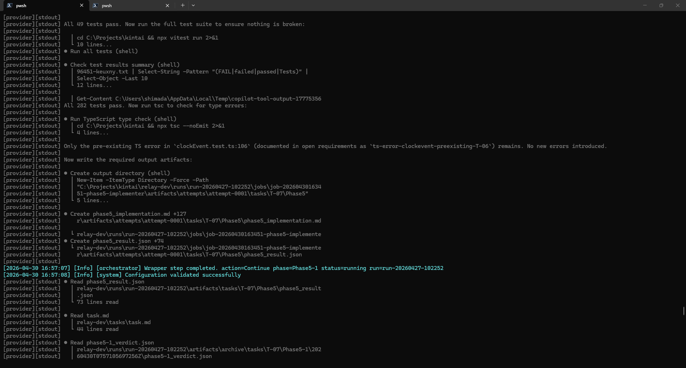
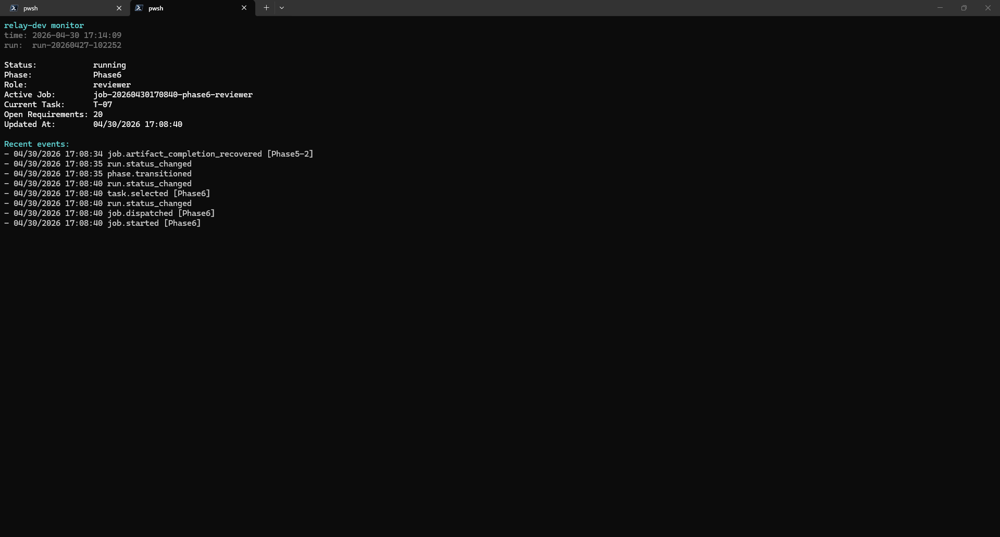

# Relay-Dev

> [!WARNING]
> **Work in progress:** relay-dev は現在開発中です。仕様、artifact schema、CLI、実行フローは変更される可能性があります。

> **Phase-driven AI development runner with reviewable artifacts and human approval gates.**
> `tasks/task.md` と `DESIGN.md` を入力に、Phase0〜Phase8 の typed artifacts と承認履歴を生成するオーケストレーター。AI provider は CLI として差し替え可能。

`runs/<run-id>/run-state.json` と `events.jsonl` を**正本**に置き、`app/cli.ps1` を single writer とするフェーズ駆動の AI 開発ランナーです。曖昧な開発依頼を、設計・実装・レビュー・検証 artifacts と approval gate に通し、**追跡可能な成果物**へ変換します。

## ハイライト

- **正本ベースの実行モデル**: `run-state.json`（state）と `events.jsonl`（append-only log）が canonical source of truth。`queue/status.yaml` と `outputs/` は自動生成の互換投影。AI 出力をテキストで流さず、JSON artifact + validator で構造化検証。
- **設計境界を contract として後段へ伝搬**: `Phase3` で `module_boundaries` / `public_interfaces` / `forbidden_dependencies` などを定義し、`Phase4` の `boundary_contract` に落として `Phase5` で拘束、`Phase5-1` reviewer が越境を検出。カプセル化を artifact schema と reviewer gate で維持する。
- **`DESIGN.md` を visual contract として伝搬**: `Phase0` で `design_inputs` / `visual_constraints` を抽出し、`Phase1` の `visual_acceptance_criteria`、`Phase3/4` の `visual_contract`、`Phase5-1` の整合性チェックへ引き継ぐ。
- **Artifact-only repair lane (`repairer`)**: validator が落ちた artifact だけを修復対象にする専用 role。`artifact-repair-policy.ps1` が repairability を判定し、`repair-diff-guard.ps1` が immutable field の改変を機械的に拒否する。product code への変更と review 判断は構造的に禁止。
- **Attempt-scoped staging と post-run commit transaction**: dispatch 前 archive、attempt-scoped staging、validation pipeline、commit を 1 transaction にまとめ、retry 時の部分書きや stale state に耐える。
- **Provider 差し替え**: `codex` / `gemini` / `copilot` / `claude` の各 CLI を adapter で吸収。設定 YAML の切替だけで provider を入れ替えられる。
- **人間承認 gate**: `Phase3-1` / `Phase4-1` / `Phase7` で `y` / `n` / `c`（条件付き）/ `s` / `q` の対話承認。CI と `tests/regression.ps1`（~3,000 行）で挙動を固定。

## スクリーンショット

| 実行中の orchestrator worker | run monitor (`watch-run.ps1`) |
| --- | --- |
|  |  |

左: `Phase5-1` reviewer 完了直後に orchestrator が `Phase5` implementer artifact を attempt-scoped staging へ書き出している様子。
右: `runs/run-20260427-102252` を monitor pane から追跡。`phase.transitioned` / `task.selected` / `job.dispatched` 等の event が canonical log から読み出されている。

## 一枚図

```text
        tasks/task.md  (+ optional DESIGN.md)
                  │
                  │ Phase0 (generate or import seed)
                  ▼
        outputs/phase0_context.{md,json}   ← validator-checked seed
                  │
                  ▼
   Phase1 ─► Phase2 (clarification fallback) ─► Phase3 ─► Phase3-1 (review)
                                                     │
                          Phase4 ─► Phase4-1 (review) ─► Phase5
                                                     │
                                  Phase5-1 (review) ─► Phase5-2 (reviewer)
                                                     │
                                       (invalid_artifact ─► repairer lane)
                                                     │
                                  Phase6 ─► Phase7 ─► Phase7-1 ─► Phase8
                                                     ▼
        runs/<run-id>/
          ├─ run-state.json          ← canonical state (single writer)
          ├─ events.jsonl            ← append-only event log
          ├─ artifacts/run|tasks/... ← canonical artifact store
          └─ jobs/<job-id>/...       ← provider job IO
        outputs/, queue/status.yaml  ← auto-generated compatibility views
```

## Tech stack

- 言語 / runtime: PowerShell 7 (`pwsh`) ／ Windows Terminal または tmux 上の visible orchestrator worker
- 規模: app 配下 PowerShell ~12k LoC（48 ファイル）、phase prompts ~2.6k 行、`tests/regression.ps1` 単体で ~3k 行・160KB
- AI provider: Codex CLI / Gemini CLI / GitHub Copilot CLI / Claude Code（YAML 切替）
- CI: GitHub Actions で構文チェック + `tests/regression.ps1` + `scripts/check-public-examples.ps1`（公開 example sanitizer）

## 5分で見る relay-dev

1. この README のハイライト・スクリーンショット・一枚図
2. **[docs/guide/](./docs/guide/)** — アーキテクチャ・フェーズ・artifact・repairer・設計契約・skill・provider・運用の詳細ハンドブック（推奨）
3. [docs/architecture/architecture-redesign.md](./docs/architecture/architecture-redesign.md): canonical state モデルとリファクタの目的
4. [docs/architecture/redesign-design-spec.md](./docs/architecture/redesign-design-spec.md): engine / artifact / approval の設計仕様
5. [docs/plans/repairer-implementation-plan.md](./docs/plans/repairer-implementation-plan.md): artifact-only repair lane の設計判断と非交渉制約
6. [docs/evaluations/relay-dev-evaluation-2026-04-30.md](./docs/evaluations/relay-dev-evaluation-2026-04-30.md): 直近の自己評価とギャップ分析
7. [docs/ideas/portfolio-roadmap.md](./docs/ideas/portfolio-roadmap.md): 公開化のロードマップ（Phase A/B/C）

## 非対象

relay-dev は汎用 AGI でも完全無人の自律運転基盤でもなく、本番 SaaS でもありません。**人間承認を前提にした開発 runner** です。安全性は runtime enforcement と prompt / 運用規律を分けて扱います。旧来の「2 エージェントが `queue/status.yaml` を受け渡す仕組み」からリファクタされ、現在は canonical state ベースの単一 orchestrator worker に寄せています。

## アーキテクチャ概念

### 正本と互換投影

| パス | 役割 | 扱い |
| --- | --- | --- |
| `runs/<run-id>/run-state.json` | 現在状態の正本 | engine が `app/cli.ps1` から atomic write |
| `runs/<run-id>/events.jsonl` | append-only event log | engine が追記 |
| `runs/<run-id>/artifacts/...` | canonical artifact store | validator / transition の入力 |
| `runs/current-run.json` | 現在の run ポインタ | `new` / `resume` で更新 |
| `queue/status.yaml` | 互換ステータス表示 | 正本から自動生成。直接編集しない |
| `outputs/` | 互換 artifact projection | 正本から自動生成 |

同一 run への二重 `step` は `runs/<run-id>/run.lock` で直列化されます。状態確認や障害調査では常に `runs/<run-id>/...` を優先してください。

### Phase0 と seed import

- `tasks/task.md` は全 phase 共通の必須 external input。
- `DESIGN.md` は optional（`config/settings.yaml` の `paths.design_file`、未設定なら `paths.project_dir/DESIGN.md`）。
- `outputs/phase0_context.{md,json}` が揃い、JSON が validator を通る場合、`step` はこれを `SeedPhase0` として import し、`Phase0` の再生成をスキップして `Phase1` へ進みます。
- canonical artifact は `runs/<run-id>/artifacts/run/Phase0/phase0_context.{md,json}` に保存。

### 設計契約とデザイン契約

| 流れ | 抽出 / 定義 | 拘束 / 検証 |
| --- | --- | --- |
| 設計境界 | `Phase3` が `module_boundaries` / `public_interfaces` / `allowed_dependencies` / `forbidden_dependencies` / `side_effect_boundaries` / `state_ownership` を定義 → `Phase4` で `boundary_contract` に落とす | `Phase3-1` reviewer が境界の妥当性を確認 → `Phase5` が contract を守って実装 → `Phase5-1` が越境を証拠付きで検出 |
| Visual design | `Phase0` が `DESIGN.md` から `design_inputs` / `visual_constraints` を抽出 → `Phase1` が `visual_acceptance_criteria` に変換 | `Phase3/4` が `visual_contract` を組み立て → `Phase5` が遵守 → `Phase5-1` が整合性チェック |

カプセル化と見た目を、README 上の方針ではなく artifact schema と reviewer gate で維持します。

### フェーズ構成

```text
Phase0 -> Phase1 -> [Phase2 fallback] -> Phase3 -> Phase3-1
       -> Phase4 -> Phase4-1
       -> Phase5 -> Phase5-1 -> Phase5-2
       -> Phase6 -> Phase7 -> Phase7-1 -> Phase8
```

- `implementer`: Phase0/1/2/3/4/5/7-1/8
- `reviewer`: Phase3-1/4-1/5-1/5-2/6/7
- `Phase2` は requirements / seed / repo 調査で吸収しきれない clarification debt が残るときの fallback。`unresolved_blockers` が残ったら human pause に入り、回答反映後 `y` で `Phase0` から再開。
- 実進行は `WorkflowEngine` が `run-state.json` を読んで次 action を決め、必要な job だけを provider CLI に dispatch する。

## セットアップと使い方

### 必須

- PowerShell 7 (`pwsh`)
- AI provider CLI（Codex / Gemini / Copilot / Claude のいずれか）
- Windows: `wt.exe` ／ Linux・macOS: `tmux`

### 設定ファイル

| ファイル | 用途 |
| --- | --- |
| `config/settings.yaml` | ローカル実行設定（Git 管理外。下記 example からコピー） |
| `config/settings-codex.yaml.example` | Codex 用サンプル |
| `config/settings-gemini.yaml.example` | Gemini 用サンプル |
| `config/settings-claude.yaml.example` | Claude Code 用サンプル |
| `config/settings-copilot-cli.yaml.example` | Copilot 用サンプル |

### CLI が正面入口

```powershell
pwsh -NoLogo -NoProfile -File .\app\cli.ps1 new      # 新しい run を作成
pwsh -NoLogo -NoProfile -File .\app\cli.ps1 resume   # 既存 run を再開
pwsh -NoLogo -NoProfile -File .\app\cli.ps1 step     # 1 step 進める（task lane は既定で auto parallel）
pwsh -NoLogo -NoProfile -File .\app\cli.ps1 show     # 現在の run-state を表示
```

`start-agents.*` と `agent-loop.ps1` は CLI を呼ぶ薄い wrapper です。Windows は `start-agents.ps1` が `cli.ps1 new|resume` → stale worker 停止 → Windows Terminal で `agent-loop.ps1 -Role orchestrator` を起動。Linux / macOS は `start-agents.sh` が tmux 上に orchestrator worker と `watch-run.ps1` の 2 pane を作る、いずれも visible な単一 orchestrator worker 構成です。

`execution.mode` の既定は `auto` です。run-scoped phase は従来どおり single dispatch、Phase5 以降の task-scoped lane は Phase4 task 登録後に `parallel` lane へ切り替わり、`parallel_safety: parallel` かつ `resource_locks` が衝突しない task だけを isolated workspace の `parallel-step` でまとめて実行します。安全に並列化できない task は同じ `step` 経路内で single dispatch に落ちます。デバッグ時は `config/settings.yaml` の `execution.mode: single` で従来動作に戻せます。

### 推奨運用（AI が起動準備まで担当）

1. AI に `relay-dev-front-door` を読ませて要件を対話で固める
2. AI が `relay-dev-seed-author` で `tasks/task.md` と必要な `Phase0` seed を作る
3. AI が `relay-dev-operator-launch` で `start-agents.ps1` を実行し、`run_id` と現在 phase を返す
4. `Phase2` で pause したら `relay-dev-phase2-clarifier` で質問を要約して回答を反映、`y` で再開

人間は要件決定とレビュー判断に集中します。

### 同梱 skill 一覧

skill は repo 内 `skills/` で管理し、Codex の実行時には `$CODEX_HOME/skills/`（Windows: `%USERPROFILE%\.codex\skills\`）にコピーまたは symlink で配置します。

| Skill | 担当 | 使う場面 |
| --- | --- | --- |
| `relay-dev-front-door` | 対話による要件整理。1 ターン 1〜3 問の壁打ちで `requirements` / `constraints` / `non_goals` / `design_inputs` まで正規化 | 要件がまだ曖昧、選択肢を比較したい |
| `relay-dev-phase2-clarifier` | `Phase2` の `unresolved_blockers` を要約し、対話結果を seed に反映 | `Phase2` で human pause に入った |
| `relay-dev-seed-author` | `tasks/task.md` と `outputs/phase0_context.*` を整える。妥当な既存 seed は再利用 | front-door の会話が固まり、起動入力を作る段階 |
| `relay-dev-operator-launch` | canonical state を見て `new` / `resume` / `step` / `start-agents.ps1` のどれを使うか決める | 実行コマンドの選択に迷う |
| `relay-dev-troubleshooter` | `run-state.json` / `events.jsonl` / job IO を read-only で読み、停止原因を切り分ける | run が止まった、provider 失敗 |
| `relay-dev-course-corrector` | 仕様変更を `rollback` / `pause` / `pivot` / `restart` に分類し、影響を整理 | 途中で方針を変えたい、いったん止めたい |

`runs/`、`outputs/`、`queue/` のような runtime 領域には skill を置きません。

### 人間レビュー

```yaml
human_review:
  enabled: true
  phases: [Phase3-1, Phase4-1, Phase7]
```

選択肢: `y` 承認 / `n` 拒否 / `c` 条件付き承認 / `s` 今回のみスキップ / `q` 中断。

### 確認・調査コマンド

```powershell
pwsh -NoLogo -NoProfile -File .\app\cli.ps1 show
Get-Content .\runs\<run-id>\events.jsonl
Get-Content .\dashboard.md
```

問題が起きたら、`cli.ps1 show` → `run-state.json` → `events.jsonl` → `runs/<run-id>/jobs/<job-id>/` → `dashboard.md` の順に確認します。`queue/status.yaml` は確認用であって調査の正本ではありません。

### CI / 回帰テスト

```powershell
pwsh -NoLogo -NoProfile -File tests/regression.ps1
```

CI では PowerShell 構文チェック、`tests/regression.ps1`、`scripts/check-public-examples.ps1` を実行します。

## ディレクトリ構成

```text
relay-dev/
├── app/
│   ├── cli.ps1                # single writer Control Plane
│   ├── core/                  # engine, artifact repo, transactions, repair lane
│   ├── execution/             # provider dispatch & job runner
│   ├── phases/                # phase registry / per-phase modules
│   └── prompts/               # agent-facing prompts (system & per-phase)
├── config/                    # local settings.yaml + provider examples
├── docs/                      # architecture / plans / evaluations / ideas / worklog
├── examples/                  # public sanitized examples (manifest required)
├── outputs/                   # compatibility projection (auto-generated)
├── queue/                     # compatibility status (auto-generated)
├── runs/                      # canonical state / events / artifacts
├── skills/                    # AI 用作業手順書（Codex skill 同梱用）
├── tasks/                     # tasks/task.md（run の external input）
├── tests/regression.ps1       # ~3k LoC regression harness
├── scripts/                   # public-example sanitizer 等
├── agent-loop.ps1             # polling wrapper around cli.ps1 step (auto parallel aware)
├── watch-run.ps1              # monitor pane
├── start-agents.ps1 / .sh     # visible worker launcher
└── lib/, logs/, dashboard.md
```

## ドキュメント索引

| カテゴリ | 場所 | 概要 |
| --- | --- | --- |
| **Guide** | [docs/guide/](./docs/guide/) | アーキテクチャ・フェーズ・artifact・repairer・設計契約・skill・provider・運用を分割解説したハンドブック |
| Architecture | [docs/architecture/](./docs/architecture/) | リファクタ設計、engine / artifact 仕様、skill 分割案 |
| Plans | [docs/plans/](./docs/plans/) | phase-transition refactor、repairer 実装計画、redesign tasks |
| Evaluations | [docs/evaluations/](./docs/evaluations/) | 自己評価メモ（2026-04-06 / 04-15 / 04-30） |
| Investigations | [docs/investigations/](./docs/investigations/) | provider / runtime 調査メモ |
| Ideas | [docs/ideas/](./docs/ideas/) | `portfolio-roadmap.md`、`portfolio-improvement-backlog.md` などの将来構想 |
| Worklog | [docs/worklog/](./docs/worklog/) | 日次作業ログ（`AGENTS.md` / `skills/worklog/SKILL.md`） |
| Examples | [examples/README.md](./examples/README.md) | 公開 example の方針（manifest、redaction、validator gate） |

### コアモジュール早見表

| ファイル | 役割 |
| --- | --- |
| `app/cli.ps1` | 単一書き込み口の Control Plane (`new` / `resume` / `step` / `show`) |
| `app/core/workflow-engine.ps1` | `run-state.json` を見て次 action を決める engine |
| `app/core/run-state-store.ps1` | 正本 state の atomic write / lock |
| `app/core/artifact-repository.ps1` | canonical artifact store と attempt-scoped staging |
| `app/core/artifact-validator.ps1` | JSON artifact の schema enforcement |
| `app/core/phase-execution-transaction.ps1` | dispatch 前 archive / validate / commit を 1 transaction にまとめる |
| `app/core/phase-validation-pipeline.ps1` | validator chain の orchestration |
| `app/core/phase-completion-committer.ps1` | staging から canonical への commit |
| `app/core/artifact-repair-policy.ps1` | repairable failure の分類 |
| `app/core/artifact-repair-transaction.ps1` | `invalid_artifact -> repair -> revalidate -> commit` レーン |
| `app/core/repair-diff-guard.ps1` | repairer が触ってはいけない field の機械的検出 |
| `app/core/transition-resolver.ps1` | phase 遷移ルール |
| `app/phases/phase-registry.ps1` | phase / role 割り当て |
| `app/prompts/phases/*.md` | agent-facing prompt（英 instruction + 日本語 few-shot） |

README と実装が食い違う場合は、`app/cli.ps1` → `app/core/*` → `app/phases/phase-registry.ps1` → `tests/regression.ps1` → `docs/architecture/architecture-redesign.md` の順を信じてください。

## ライセンス

[MIT License](./LICENSE)
